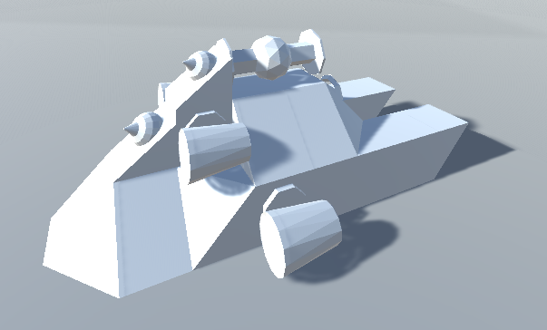
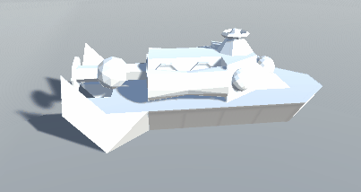

# Disclaimer

I have unfortunately lost interest in continuing this project.
It has been a great learning experience, but I have reached my goal and therefore lost my motivation.
I was able to do what I wanted to do: block/system based structures in a networked environment.
The project does not have any special ideas, game mechanics which would justify further work.
Expect no further commits.

# BotMender

A TPS Unity game where bots can be built from blocks and then taken into (PvP) action.
The current version is an early prototype and is continuously being updated.

Here are two examples of bots: *(authentic programmer graphics)*  
  

And a showcase of the custom networking implementation (the server is fully authoritative):  

## Blocks, building, systems

Each block has mass, health and "connect-sides": sides on which it can connect to other blocks.
The block placement system is expected to get reworked a bit due to only allowing
blocks which take a whole block unit of space.

All blocks may also define a system: if the block is placed, the system gets installed onto the bot.
There are 3 kinds of system: propulsion, weapon and active.
An active system usually gives some sort of special ability which has a cooldown.
Passive systems might get introduced in the future.

## Bots (structures)

A structure is a collection of its parts (blocks) and systems.
There are two types of structures: editable (still under construction) and complete (usable, playable).
Since the systems are defined by the blocks, a structure can be serialized just by serializing its blocks.
The health of a structure is the sum of its blocks' health.
A block/system can be specified by specifying the structure's ID and the block's position.

# Current state

This project is currently an early prototype.
Nothing is final, and everything which has been made is subject to improvement.
The current goal is to implement a basic version of as many of the features as possible.
This allows design errors to be spotted early on,
before any radical changes would be required when fixing them.
This also means that all front-end development is kept to a bare minimum.

# Contributing

If you are thinking of contributing, feel free to do so, no need to be shy!
As outlined in the previous paragraph, the main focus is back-end development for the moment,
but don't let that discourage you if that's not your thing.
Check out the [contributing file](CONTRIBUTING.md) for more information.

# Codebase

Verbose naming and lots of documentation should make the codebase easy to read.
Unfortunately, it's not always enough and that's what this section hopes to aid.

## Networking

[DoubleSocket](https://github.com/Trigary/DoubleSocket) is used to handle the networking.
This allows the bypassing of Unity's limited and poorly documented HLAPI and LLAPI.
The library uses a synchronized TCP and UDP socket for each party,
therefore taking advantage of TCP's flow and congestion control while also allowing
UDP packets to be used when reliability and ordered packets are not required.

Most importantly of all, the servers are fully authoritative in this implementation.
For example, this is how movement is networking is done in this project:
all parties extrapolate the position of the networked objects using physics and the last input.
The local client knows that the server also does this extrapolation,
therefore it only applies the input change with a delay (of trip time): this minimizes the time
difference between the time the server and the time the client applies the input change,
leading to near identical predictions, therefore only unnoticeable state corrections.

The game is designed with both dedicated servers and player hosted games in mind.
This means that the server may or may not be a client as well.
UDP packets are sent to all connected clients, while TCP packets are usually sent from the server
to all non-host clients (who are referred to as client-only clients) or from one client to the server.
Packet sends between the host-client and the server are minimized,
since it's an overhead which is usually easy to circumvent.
Network condition simulation has been implemented.

## Adding new blocks, systems

All instructions about how to register blocks, systems can be
found in the `BlockFactory` and `SystemFactory` classes.
